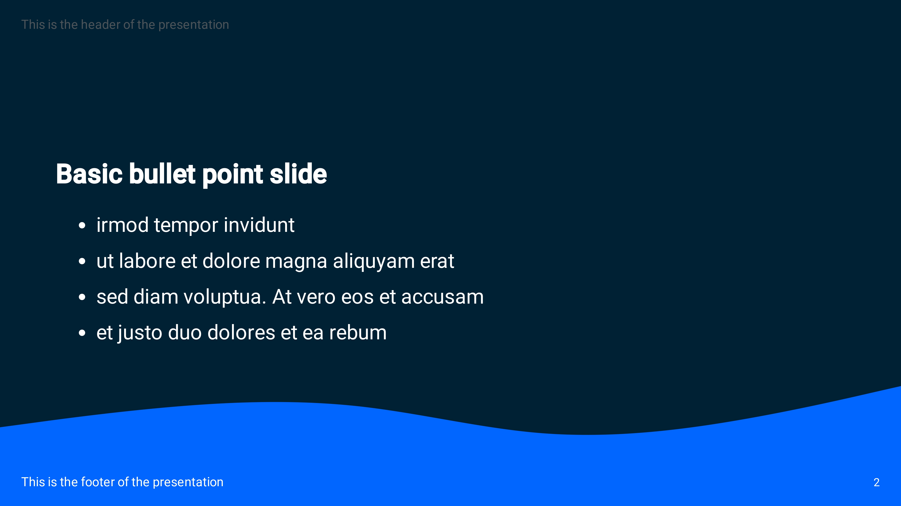
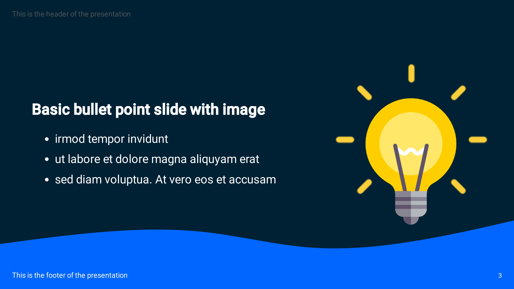

# Marp Theme: Wave







## Installation
Download the ./source directory and add this to your settings.json in vs code:
```json
{
    "markdown.marp.themes": 
    [
      "./source/wave.css"
    ]
}
```

Now you can use "wave" as a normal marp template:
```
---
marp: true
theme: wave
paginate: true
transition: fade 0.3s
---
```

## Sources
- [Color Pattern](https://coolors.co/ffffff-80b3ff-0066ff-002233)
- [Background](https://app.haikei.app/)
- [Code Highlighting](https://github.com/chriskempson/tomorrow-theme)
- [Code Style](https://neumorphism.io/#e0e0e0)
